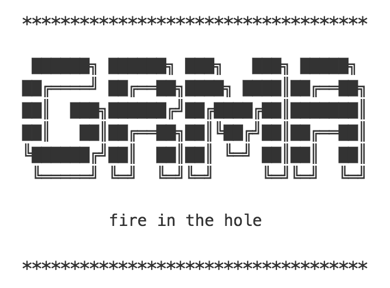

<p align="center">

</p>

# Overview

A simple gunicorn like gRPC management server.

# How to used

inherit `ServerBase` to create your own `JediServer` Class:

```python
from grma.server.base import ServerBase

class JediServer(ServerBase):
    """Your gRPC server class"""

    def start(self):
        pass

    def bind(self, host, port, private_key_path='', certificate_chain_path=''):
        pass

    def stop(self, graceful_timeout=3):
        pass

app = JediServer()
```

Launching should be simple:

    run grma --port=50051 --cls=app:app --num=8 --daemon=1


Get more from help


```
usage: grma [-h] [--host HOST] [--port PORT] [--private PRIVATE]
            [--certificate CERTIFICATE] --cls CLS [--num NUM] [--pid PID]
            [--daemon DAEMON]

A simple gunicorn like gRPC server management tool

optional arguments:
  -h, --help            show this help message and exit
  --host HOST           an string for gRPC Server host
  --port PORT           an integer for gRPC Server port
  --private PRIVATE     a string of private key path
  --certificate CERTIFICATE
                        a string of private certificate key path
  --cls CLS             a string of gRPC server module [app:server]
  --num NUM             a int of worker number
  --pid PID             pid file for grma
  --daemon DAEMON       run as daemon
```

# TODO

Lots to do...
